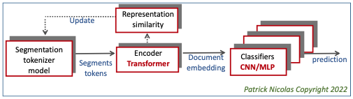

##  Document classification using BERT with Apache Spark and Deep Java Library
### Patrick Nicolas - Last update 06.17.2023 V0.8

## Discriminative pre-trained transformer on Apache Spark

**Supporting Documents**        
- [Blog: BERT with Deep Java Library & Spark](http://patricknicolas.blogspot.com/2023/01/bert-with-deep-java-library-spark.html).     
- [Blog: Stem-based BERT Wordpiece Tokenizer](http://patricknicolas.blogspot.com/2023/03/stem-based-bert-wordpiece-tokenizer.html).     
- [Blog: Autonomous and Computer-aided Medical Coding](https://aiforehr.blogspot.com/2023/02/autonomous-vs-computer-aided-medical.html).     

# Overview
The objective if this project is to **classify document** using BERT (Bidirectional Embeddings 
Representation of Transformer). The low latency distributed deep learning models are implemented using Apache  Spark, Kafka and Amazon open source deep java library (https://djl.ai). 

   
The components of the **discriminative transformer** model are     
- *Tokenizing model*: Various vocabularies/dictionaries assigned to specific type of clinical notes        
- *Transformer model*: The transformer is pre-trained over 4.4 million clinical notes with contextual data. It generates a 512 of 784 size embedding vector to represent each clinical note    
- *Classifier model*: A classifier used the embedding vector as input and submitted claim as labels.      
    
     
One main drawback of transformers is their complexity and the very large number of parameters as described in the following table. 

|Model|Number of parameters|
|:--|:--|
|Simple linear regression|2|
|Machine learning models|10-1,000|
|Deep learning models|10,000 -1 Million|
|Transformers|50 Million - 500 Billion|
|Human brain|~100 Trillion|    

_Notes_:      
- AWS-AI support team: **Kimberg Zach**, **Frank Liu**, **Sadaf Fardeen**.   
- Feedback on some techniques provided by LinkedIn **Natural Language Processing** group.     
- A similar design (Scala, Spark, NVDIA accelerator, DJL, Kubernetes) is used at Amazon for product recommendation.      

      
 

# Status
The main limitation of the model is dealing with unbalanced training set, specifically the 
number of document per a given topic in the training set. Although the model is very accurate for 
number of documents per topics > 20.    
The solution should be a combination of the following approaches.     
- Augment documents associated with a sparse topic with synthetic note using semantic substitution.
- Augment documents associated with a sparse topic through random insertion/deletion.    
- Augment vector representation     
- Oversampling of documents associated with a sparse topic.    
- Cluster topics (KNN?).    
- Claim weighting (high weight for sparse topics).   
- Ensemble of classifiers (could be very costly).    
- One-vs-all strategy.   
- Use encoded claims as labels using Tiny BERT.    

# Release timeline

| Date       | Action                       |
|:-----------|:-----------------------------|
| 06.11.2022 | Start project                |
| 06.14.2022 | Evaluation of DJL v0.18      |
| 06.30.2022 | Start implementation v0.0    |
| 07.02.2022 | First commit MLOP repository |
| 08.06.2022 | Version 0.0                  |
| 10.02.2022 | Version 0.1                  |
| 11.18.2022 | Version 0.2                  |
| 12.05.2022 | Version 0.3                  |
| 01.02.2023 | Version 0.4                  |
| 01.22.2023 | Version 0.5                  |
| 02.13.2023 | Version 0.6                  |
| 04.28.2023 | Version 0.7                  |
| 06.17.2023 | Version 0.8                  |

# Technology

## Architecture

Python is a very convenient language and ecosystem to build, train and evaluate models, but it is very inefficient in processing real-time requests (Latency, Memory consumption,….).
Once a model is trained, it can be deployed into the production workflow running Java or Scala with large scale frameworks such as Kafka, Storm or Spark. It is becoming increasing common to have DL models to be configured and trained through Python, and serving prediction through Java (Amazon, Netflix,...).

 
    
**Current components**     

|Components|Num parameters|Time to train|   
|:--|:--|:--|     
|Tokenizer|4| 0.1 hr|     
|Transformer encoder|110,200,000|115 hrs|    
|Feed forward classifier|196,600|16 hrs|      

(1) 400,000 documents on 16 virtual cores CPU with 64 GB and V100 GPU with 16 GB    
      

## Workflow
Two new features introduced in Apache Spark 3.x make it easier to managed deep learning models:

- Support for dynamic allocation of Kubernetes pods. The only required input is the docker file as argument of the Spark application (spark-submit). Kubernetes cluster are an alternative to the traditional Yarn resource manager 
- Integration with the NVIDIA GPU accelerator (Rapid) for manage GPU clusters (federation)

  
Architecture of amazon.com retail     

One key challenge for for an effective training and inference is the distribution of the computation load:    
- Across CPUs for data processing pipeline/ETLs  
- Across GPUs for deep learning pipeline   
- Between the CPU and GPU clusters   
     
      

**References:**.  
- [Apache Spark on Kubernetes](https://spark.apache.org/docs/3.0.0-preview/running-on-kubernetes.html).  
- [Distributed inference at Netflix](https://aws.amazon.com/blogs/opensource/how-netflix-uses-deep-java-library-djl-for-distributed-deep-learning-inference-in-real-time/).   
- [NVIDIA: GPU-Accelerated Apache Spark](https://www.nvidia.com/en-us/deep-learning-ai/solutions/data-science/apache-spark-3/).   
- [Comparison AWS GPU instance](https://towardsdatascience.com/choosing-the-right-gpu-for-deep-learning-on-aws-d69c157d8c86)

## Models
The data flow is composed of three models.  
1. Document segmentation and tokenization
2. Variant of Bidirectional Embedding Representation for Transformers (BERT) for encoding [Pre-training].  
3. Feed forward neural network for classification of documents.

.   

The models are assembled from layers into blocks, then blocks into models according to a commonly used modularity scheme (Keras, DJL,..).  

The next step is to integrate the task specific, downstream model with the pre-trained models.   
There are two options:     
- **Feature extraction** Pre-training is uses a embedding feature extraction and are not updated when training the classifier    
- **Fine-tuning** The pre-trained weights are updated through training the classifier.      

    

## Parameters tuning
There are several components involved in the parameters tuning process:    
- Extraction of vocabulary
- Creation of tokenizer
- Transformer pre-training small sample   
- Transformer pre-training base sample
- Classifier training    

Generic/evolutionary algorithm is used to refine some of the hyperparameters

 

# Applications and Utilities

       
Complete life cycle to create a model.    
      
|Step|Application|Parameters|Descriptor|    
|:--|:--|:--|:--|         
|1|Select training set|target = MIX, ALL, CMBS|Select training set (**target**) for BERT encoder as MIX, ALL,CMBS|     
|2|**buildTrainingSet** vocabularyType true numSubModels|*runId, target, vocabularyType, minLabelFreq, maxLabelFreq, codeSemanticEnabled, punctuationEnabled*|Build a full training set with contextual document and labels   -    Input: **$target/vocabulary**,**$target/codeDescriptors.csv**  -  Output: **$target/contextDocument, $target/trainingSet, $target/subModels.csv, $target/labelIndexMap.csv**|   
|3|**preTrainBert** true|*runId, transformer, target, vocabularyType , sentenceBuilder, numSentencesPerDoc, subModelSampleSize, maxMaskingSize*|Pre-train the BERT encoder with the training set defined by its target -  Input: **$target/contextDocument, $target/trainingSet, $target/subModels.csv, $target/labelIndexMap.csv** -  Output: **Pre-trained-Bert-0000.params**|     
|3b|*transferLearning*|*runId, transformer, target, vocabularyType, sentenceBuilder, numSentencesPerDoc, subModelSampleSize, maxMaskingSize*|*Optional* Augment pre-trained transformer model|          
|4|Copy BERT model to target|*runId, transformer, target, vocabularyType , sentenceBuilder, numSentencesPerDoc, subModelSampleSize, maxMaskingSize*|Optional: Copy Pre-trained-Bert params (MIX, ALL,..) to *target/model/runId* with target = CMBS, AMB, ...| 
|6|**classify** ALL|*target, runId, vocabularyType, transformer, sentenceBuilder, numSentencesPerDoc, modelId, dlModel, dlLayout, epochs, minSampleSizePerSubModel, maxSampleSizePerSubModel*|Train the neural classifier using labels or claims using the same parameters are buildTrainingSet and preTrainBert  - Output: **subModelTaxonomy.csv**, **Trained-Bert-0000.params** for each sub-model|     
|7|**evaluation** s3 stageIndex|*s3RequestPath, s3FeedbackPath, table, sampleSize, preloadedSubModels*|Evaluate prediction using a Kafka simulator for request and labels  -  Output: **metrics/runId/modelId/prediction**|   
|8|**launch**|*s3RequestPath, s3FeedbackPath, table, sampleSize, preloadedSubModels*|Evaluate prediction using a Kafka simulator for request and labels  -  Output: **metrics/runId/modelId/prediction**|  

   

 
   
      

# Modeling
There are 4 distinct data flows:    
- Generation of vocabulary and pre-processing of documents.   
- Pre-training on vocabulary using *transformers* as encoder.   
- Classifier training using embeddings generated during pre-training.   
- Run-time prediction.    

**Training sets**    

|Model|Requests|Feedbacks|CtxDocument|Training|
|:--|:--|:--|:--|
|ALL-TFIDF|1,008,284|853,479||3,749|
|LARGE-TFIDF|4,231,404|4,480,654|798,929|21,875|
|XLARGE-TF92|4,463,389|5,650,211|4,457,327|2,318|   
|XLARGE2-TF92|4,463,389|5,650,211|4,457,327||  
|XLARGE4-TF94|4,463,389|5,650,211|4,457,327||  

(*) LARGE model may have duplicate requests and feedbacks

**Tokenizers**    
Here are the list of tokenizer models evaluated in pre-processing stage.     

|Vocabulary type| Vocabulary components                                                           |Av. Num tokens per document|Size|
|:--|:--------------------------------------------------------------------------------|:--|:--|
|**AMA**| terms, abbreviation, Word pieces decomposition                                  |181|137,423|
|**Base**| Abbreviations, terms, Word pieces decomposition                                 |NA|NA|
|**Corpus**| Abbreviations, terms, Contextual, TfIdf 0.5-EMR, Word pieces decomposition      |193|NA|
|**FullEmr**| Abbreviations, terms, Contextual, Topic descriptor, TfIdf 0.7-EMR, Word pieces  |NA|NA|
|**FullNote**| Abbreviations, terms, Contextual, Topic descriptor, TfIdf 0.7-Note, Word pieces |NA|154,370|
     
      

## NLP Pre-processing

### Augmentation 
The various augmentation techniques to address unbalanced data ...   
- Random replacement by Synonyms.      
- Random replacement of character by 'x'.    
- Random replacement of token by '[UNK]'.    
- Random swap of tokens.     

Results on a random sample of training sub-models.    
randomUNK.    
Num Yes 30454.    
Num No 267242.    
Num of requests: 297696.    
10.2298.    
Number of sub model predictors: 18.    
    
randomChar.     
Num Yes 28349.    
Num No 284659.    
Num of requests: 313008.    
9.0569.    
Number of sub model predictors: 16.     
      
none.     
Num Yes 12641.      
Num No 269839.     
Num of requests: 282480.     
4.4750.     
Number of sub model predictors: 14.     
    
Filter-20.      
Num Yes 13096.      
Num No 200.      
Num of requests: 13296.     
98.4957.     
Number of sub model predictors: 3.     
     
Filter-8.   
Num Yes 41606.    
Num No 86362.    
Num of requests: 127968.    
32.5128.    
Number of sub model predictors: 8.    
     
Filter-16.     
Num Yes 86759.     
Num No 155785.     
Num of requests: 242544.     
35.7704.    
Number of sub model predictors: 12.     
     
Filter-20.     
Num Yes 13096.   
Num No 200.   
Num of requests: 13296.  
98.4957.  
Number of sub model predictors: 3.  
    

Filter-20.   
**randomDuplicate**.   
Num Yes 34511.  
Num No 283441.   
Num of requests: 317952.    
10.8541.   
Number of sub model predictors: 19.   

SYN-16-Duplicate.  
**randomDuplicate**.      
num Yes 33760.   
Num No 305412.    
Num of requests: 339178.    
9.9534.    
Number of sub model predictors: 24.   

SYN-16-MAX.    
**Synonyms-base**.  
Num Yes 55273.   
Num No 148967.   
Num of requests: 204240.   
27.062.   
Number of sub model predictors: 32.  
     
SYN-48.    
**Synonyms-base**.  
Num Yes 32597.   
Num No 79435.    
Num of requests: 112032.   
29.0961.   
Number of sub model predictors: 23.   

SYN-48-B.   
**Synonyms-base**.      
Num Yes 66965.   
Num No 156859.   
Num of requests: 223824.   
29.9185.   
Number of sub model predictors: 41.     
     
SYN-48-C.   
**Synonyms-base**.  
Num sub models 48.   
Num Yes 63585.   
Num No 161055.   
Num of requests: 224640.    
28.3052.   
Number of sub model predictors: 34.   

SYN-48-D.   
**Synonyms-large-xnum**.  
Num sub models 48.   
16-48     
Num Yes 59797.    
Num No 171803.    
Num of requests: 231600.  
25.8190.   
Number of sub model predictors: 31.   
   
SYN-48-E. 
**Synonyms-base**.   
20-64.  
Num sub models 48.   
Num Yes 122201.   
Num No 351895.   
Num of requests: 474096.   
25.7755.  
Number of sub model predictors:61.   
    
SYN-96-F.   
**Synonyms-large**.  
20-56.   
Num sub models 96.    
Num Yes 203653.    
Num No 381659.    
Num of requests: 585312.   
34.7939.   
Number of sub model predictors:91.    

SYN-96-G.  
**randomCorrect** 
24-64.   
Num sub models 96.   
Num Yes 210005.   
Num No 432139.   
Num of requests: 642144.   
32.7037.   
Number of sub model predictors:75.  

SYN-96-H.  
18-64   
Num sub models 96.   
**randomSynAndCorrect**.   
Num Yes 171731.    
Num No 425101.   
Num of requests: 596832.   
28.7737.  
Number of sub model predictors:90.    

SYN-96-I.  
18-64   
Num sub models 128.   
**randomCorrect**.
Num Yes 228688.   
Num No 573632.   
Num of requests: 802320.   
28.5033.   

    
    
Distribution of model type per sub model given the minimum number of documents per topic.      
|Min request per label|Num Oracle sub models|Num predictive sub models|Num unsupported sub models|
|:--|:--|:--|:--|
|20|284|470|24661|
|8|640|784|23991|

## Transformer encoder

### Epoch sampling
Taking into account natural, expected RSS memory leak, sampling the training set between epoch may be a solution.   
- **Default mode**: The same training set is used during the entire pre-training process. Convergence occurs quite fast at the cost of a smaller training set to be processed.     
- **Epoch sampling mode**: The original training set is sampled for each epoch which increase the number of epochs needed to converge.

|Bert model|Max chars|Embedding size|Num transformers|Num attention heads|
|:--|:--|:--|:--|:--|
|Tiny|128|256|4|4|
|Micro|128|512|12|8|
|Base|256|728|12|12|
|Large|512|1024|24|16|
     
           

### Embeddings
There are 3 embeddings input to the transformer:    
- Token (index)   
- Token position in sentence.    
- Sentence order in the document.   

The encoder of token for batch is defined as.    

The features and labels encoding derived from the tokens are defined as.     

### Sentence embedding
The output of the transformer encoder such as BERT is a embedding vector for each of the sentences. The embedding vector can be extracted as:    
- [CLS] token embedding: Embedding vector for the first classification token  
- Pooling output: Embedding vector created by pooling all 

## Neural classifier
There are two fundamental approaches for select a claim or document summary/abstract from a training set.   
- *Classifier* in case the number of labels (or classes) is not very large. If the number of classes is very large then the softMax layer (distribution of output probabilities) fails to distinguish similar classes. One solution is to extract cluster of labels and implement a hierarchical classifier.   
- *Transformer* The goal is to match a representation of a document against a representation of a table instead classifying a document representation against a label as with a classifier.    

**Classification modes**    

Document embedding is generated from the **concatenation** of segment embedding generated by the transformer (encoder).  
    

Document embedding is generated from the **aggregation** of segment embedding generated by the transformer (encoder).    
 

# Evaluation

## Set up
The evaluation of transformer and classification models relies on a Kafka client simulator

.     
     
   
The data flow steps are:     
1- The model consumes clinical documents loaded from S3/RDS.    
2- It predict and store claims in database.     
3- The claim is forwarded to the simulator.     
4- Actual claims are submitted   
5- Claims are merged with predicted claims.   
6- Metrics are computed and stored.   
     

## Transformer embedding similarity
The pre-training model can be validated against the labels. The similarity of CLS embedding from any notes associated with a given label should be higher than the similarity of these CLS embedding across different labels.
The average of similarity across any of the CLS prediction should be lower than the similarity of CLS embedding within any given label which should be 1

The tuning parameters for the pre-training are
- Vocabulary (AMA, Base, Ext, TfIdf, Full)
- BERT model (Micro, Base)
- Segment embedding aggregation (Concatenate, Sum)
- Segment embedding (CLS token embedding, Pooled input tokens embedding)
- Sentence builder (Segmented document + contextual variable: **CTXTXT_TXT**,  **CTXTXT_TXT_TXT**, **CTX_TXT_TXT**, **TXT_CTXTXT**, ...)  

## Document Embedding Similarity 
Comparison between two identical notes given a vocabulary, Bert model and segmentation scheme ...

|BERT model|Vocabulary|Segmentation|Segment embedding|Doc embedding|Pre-training size|num epochs|batchsize|base lr|Accuracy|  
|:--|:--|:--|:--|:--|:--|:--|:--|:--|:--|
|Micro|Extended|CTXTXT_TXT_TXT|clsEmbedding|Concatenate|320K|4|36|0.00008|0.901|
|Micro|Base|CTXTXT_TXT|Pooled output|Concatenate|220|4|20|0.0001|0.73805773 0.7488189 0.7199475 0.7566929|
|Micro|Base|CTXTXT_TXT|Pooled output|Concatenate|320K|4|20|0.0001|0.87294215 0.9040842 0.90299916 0.94163907|
|Micro|Extended|CTXTXT_TXT|Pooled output|Concatenate|360K|6|36|0.00007|0.8600784 0.9025671 0.9104828 0.8828804 0.8714113|
|Micro|Extended|CTXTXT_TXT_TXT|Pooled output|Concatenate|360K|6|36|0.00007|0.7627335 0.8192347 0.85360587 0.8927642|

## Transformer Pretraining accuracy

*Classifier sampled training FFNN*.    
Date: 12.06-09.2022    
20 Sub-models sampling
BERT model: Micro

|Neural layout|Vocabulary|Size training set|Num epochs|Size pre-trained|learning rate|Accuracy|
|:--|:--|:--|:--|:--|:--|:--|
|128|Extended|160|12|128K|0.0005|58.11%|
|96|Extended|160|12|128K|0.0005|57.74%|
|64|Extended|160|12|128K|0.0005|59.98%|
|32|Extended|160|12|128K|0.0005|55.88%|
|24|Extended|160|12|128K|0.0005|56.47%|
|64x16|Extended|160|12|128K|0.0005|57.61%|
|128x24|Extended|160|12|128K|0.0005|55.95%|
|128x48x20|Extended|160|12|128K|0.0005|56.8%|

     
Given a layout of the neural classifier, 

|Neural layout|Segmentation|Size training set|Num epochs|Size pre-trained|learning rate|Accuracy|
|:--|:--|:--|:--|:--|:--|:--|
|96|CTXTXT-TXT-TXT|28K|28|240K|0.0005|54.12%|
|96|CTXTXT-TXT-TXT|40K|28|240K|0.0005|57.99%|
|96|CTXTXT-TXT-TXT|60K|28|240K|0.0005|60.65%|
|96|CTXTXT-TXT-TXT|80K|28|240K|0.0005|62.11%|
|96|CTXTXT-TXT|120K|28|240K|0.0005|63.23%|

## Classifier training

*Classifier full training FFNN*.  
Date: 12.07-10.2022.    
320 Sub-models sampling
BERT model: Micro    

|Neural layout|Vocabulary|Segment embedding|Doc embedding|Segmentation|Min Size training set|Target size|Num epochs|Size pre-trained|learning rate|Accuracy|
|:--|:--|:--|:--|:--|:--|:--|:--|:--|:--|:--|

|64|Extended|Concatenate|Pooled output|CTXTXT-TXT|20|300|16|380K|0.0005|38.95%|
|64|Extended|Concatenate|Pooled output|CTXTXT-TXT|20|120|16|380K|0.0005|40.35%|
|96|Extended|Sum|Pooled output|CTXTXT-TXT-TXT|20|120|12|380K|0.00057|47.15%|
|96|Extended|Concatenate|clsEmbedding|CTXTXT-TXT-TXT|20|120|12|380K|0.00057|49.17%|
|96|Extended|Sum|clsEmbedding|CTXTXT-TXT-TXT|20|120|12|380K|0.00008|39.41%|
|96|Extended|Concatenate|clsEmbedding|CTXTXT-TXT-TXT|20|120|30|380K|0.0003|57.87%|
|96|Extended|Concatenate|pooledOutput|CTXTXT-TXT-TXT|20|120|36|380K|0.0003|54.97%|
|96|Extended|Concatenate|clsEmbedding|CTXTXT-TXT-TXT|20|120|42|380K|0.0003|62.04%|
|96|Extended|Concatenate|clsEmbedding|CTXTXT-TXT-TXT|40|120|48|380K|0.0006|63.66%|

# Source Code

*As of Feb 21, 2023*
19,803 lines of code.   
12,751 lines of comments, Copyrights....         
284 files.    
192 classes

`

## Environment
- Kafka 3.2.0
- Spark 3.3.1
- Hadoop 3.3.1
- Java 11.0.15
- DJL 0.21.0
- Scala 2.12.15
- EMR 6.8.0
- Tensor flow r.2.8
- Torch 1.9.0
- MXNet 1.9.1
- Kubernetes 1.19
- CUDA 11.7.64
- NCCL 2.15.1
- cuDNN 8.1.0
- NVIDIA RAPIDS 22.10`

See scripts for references

# License
*Licensed under the Apache License, Version 2.0 (the "License")*
